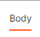
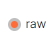
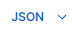

## Execute os comando no seu console do visual studio de acordo com oque pede abaixo

### instale o nodemon

```
npm install node
```
### instale o express
```
npm install express
```

### logo em seguida inicie o servidor
```
npm start
```
## baixe o postman ou o abra pelo seu navegador

crie um workspace e use esse linha para o GET para testes

http://127.0.0.1:3000/livro/pesquisa/"titulo do livro que voce deseja pesquisar"(tem que estar dentro do JSON)

caso queira atualizar as informações ou adicionar novas

### troque para Body



### clique em Raw



### troque para Json



### por ultimo copie a estrutura do JSON para o terminal

```
[
      {
        "id": 1,
        "Titulo": "Al mosso",
        "autor": "robocop",
        "ano_de_publicação": 2005,
        "gênero": "terror"
      },
      {
        "id": 2,
        "Titulo": "Meninolevado",
        "autor": "Nicolas",
        "ano_de_publicação": 2013,
        "gênero": "terror"
      },
      {
        "id": 3,
        "Titulo": "Eu amo pinta o cabelo",
        "autor": "bluezao",
        "ano_de_publicação": 2019,
        "gênero": "terror"
      }
    ]

```

### agora so trocar a função de GET para POST ou PUT e fazer as alterações

### para deletar também so repetir a mesma função do GET, so trocando o GET para DELETE e botando no endereço o livro que você deseja deletar